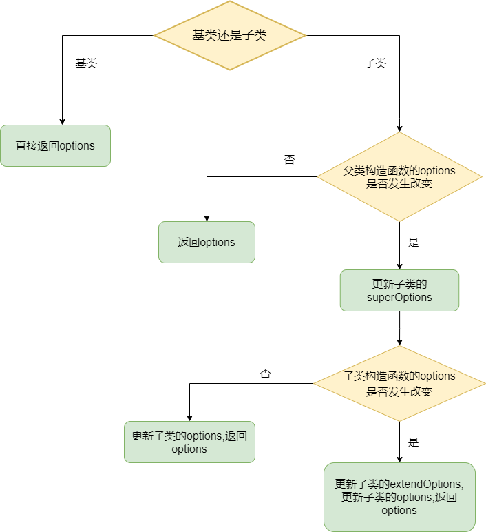
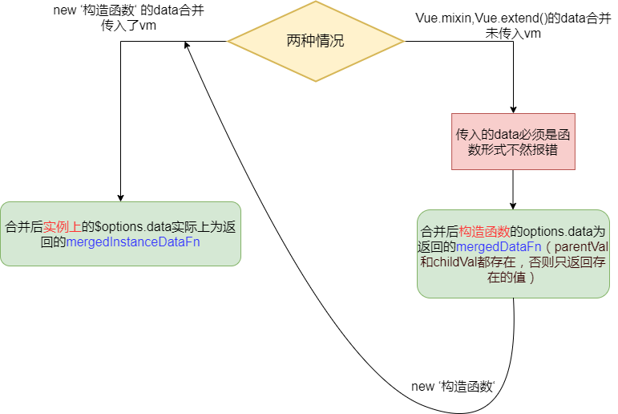

# vue入口

**new Vue()的时候干了什么？**  

## 入口文件
::: tip 文件目录
/src/core/instance/index.js  
:::
找到vue源码的入口文件，该文件创建了Vue构造函数，并执行了一系列初始化方法  
1. :point_right:[initMixin](./entry.md#initmixin)方法
2. :point_right:[stateMixin](./state.md#statemixin)方法
3. :point_right:[eventsMixin](../global-api/instance.md#eventsmixin)方法
4. :point_right:[lifecycleMixin](../global-api/instance.md#eventsmixin)方法
```js
import { initMixin } from './init'
import { stateMixin } from './state'
import { renderMixin } from './render'
import { eventsMixin } from './events'
import { lifecycleMixin } from './lifecycle'
import { warn } from '../util/index'

function Vue (options) {
  // 判断是否是通过关键字new来创建实例，否则报警告
  if (process.env.NODE_ENV !== 'production' &&
    !(this instanceof Vue)
  ) {
    warn('Vue is a constructor and should be called with the `new` keyword')
  }
  this._init(options)
}

// 一系列初始化方法
initMixin(Vue)
stateMixin(Vue)
eventsMixin(Vue)
lifecycleMixin(Vue)
renderMixin(Vue)

export default Vue
```

## initMixin
::: tip 文件目录
/src/core/instance/init.js
:::
**首先我们分析```this._init()```方法干了什么，```this._init()```在```initMixin()```中创建,关于性能相关部分，参考[window.performance](../window-api/window.md#performance)接口**  
- _init方法初始化了实例的$options,子组件使用initInternalComponent，根组件使用[mergeOptions](./entry.md#mergeoptions)方法
- 初始化组件实例关系属性，比如 $parent、$children、$root、$refs等
- 初始化自定义事件
- [initRender](../render/render.html#initrender)方法解析组件的插槽信息，得到 vm.$slot，处理渲染函数，得到 vm.$createElement 方法，即 h 函数
- 调用 beforeCreate 钩子函数
- 初始化组件的 [provide，inject](./entry.md#initprovide-initinjections) 配置项
- 数据响应式，处理 props、methods、data、computed、watch
- 解析组件配置项上的 provide 对象
- 调用 created 钩子函数

```js
/*initMixin函数定义 Vue.prototype._init方法 */
export function initMixin (Vue: Class<Component>) {
  Vue.prototype._init = function (options?: Object) {
    // 用vm指向vue实例
    const vm: Component = this
    //每个 vue 实例都有一个唯一_uid，并且是依次递增的
    vm._uid = uid++

    // 性能测试
    let startTag, endTag
    /* istanbul ignore if */
    if (process.env.NODE_ENV !== 'production' && config.performance && mark) {
      startTag = `vue-perf-start:${vm._uid}`
      endTag = `vue-perf-end:${vm._uid}`
      mark(startTag)
    }

    // 一个避免被发现的标志，observe会用到
    vm._isVue = true
    // merge options
    if (options && options._isComponent) {
      // 子组件初始化走这里
      /*
        initInternalComponent主要做了两件事情：
        1.指定组件$options原型，
        2.把组件依赖于父组件的props、listeners也挂载到options上，方便子组件调用。
      */
      initInternalComponent(vm, options)
    } else {
      // 根组件初始化走这里，为实例创建$options
      // 将构造函数上的options和传入的options合并成$options
      vm.$options = mergeOptions(
        resolveConstructorOptions(vm.constructor),//vm.constructor为Vue构造函数
        options || {},
        vm
      )
    }
    /* istanbul ignore else */
    if (process.env.NODE_ENV !== 'production') {
      initProxy(vm)
    } else {
      vm._renderProxy = vm
    }
    // expose real self
    vm._self = vm
     // 初始化组件实例关系属性，比如 $parent、$children、$root、$refs 等
    initLifecycle(vm)
    /**
     * 初始化自定义事件，这里需要注意一点，所以我们在 <comp @click="handleClick" /> 上注册的事件，监听者不是父组件，
     * 而是子组件本身，也就是说事件的派发和监听者都是子组件本身，和父组件无关
     */
    initEvents(vm)
    // 解析组件的插槽信息，得到 vm.$slot，处理渲染函数，得到 vm.$createElement 方法，即 h 函数
    initRender(vm)
    // 调用 beforeCreate 钩子函数
    callHook(vm, 'beforeCreate')
    // 初始化组件的 inject 配置项，得到 result[key] = val 形式的配置对象，然后对结果数据进行响应式处理，并代理每个 key 到 vm 实例
    initInjections(vm) 
    // 数据响应式的重点，处理 props、methods、data、computed、watch
    initState(vm)
    // 解析组件配置项上的 provide 对象，将其挂载到 vm._provided 属性上
    initProvide(vm)
    // 调用 created 钩子函数
    callHook(vm, 'created')

    // 性能测试
    /* istanbul ignore if */
    if (process.env.NODE_ENV !== 'production' && config.performance && mark) {
      vm._name = formatComponentName(vm, false)
      mark(endTag) 
      measure(`vue ${vm._name} init`, startTag, endTag)
    }

    // 如果发现配置项上有 el 选项，则自动调用$mount 方法
    if (vm.$options.el) {
      vm.$mount(vm.$options.el)
    }
  }
}
```
### resolveConstructorOptions
有两种情况会执行到该方法
1. new Vue()
2. new Vue.extend() ,**Vue.extend()为返回的子类构造函数**  
```new Vue()```时和```new vue.extend()```都会调用该方法，
```vue.extend()```时```Ctor.super```才存在，super为父级的构造函数，super，superOptions，sealedOptions的含义看[Vue.extend方法](../global-api/global.md#vue-extend)
::: warning 注意
resolveConstructorOptions方法操作的都是挂载在构造函数上的options
:::

```js{13,16}
/**
 * @description: 解析构造函数的options，如果存在父类，则判断父类options是否是最新的进行更新
 * @param {Ctor} 传入的构造函数
 * @return {options} 返回解析后的options
 */
export function resolveConstructorOptions (Ctor: Class<Component>) {
  let options = Ctor.options
  // Ctor.super存在，说明是Vue.extend()返回的子类
  if (Ctor.super) {
    // 递归调用
    const superOptions = resolveConstructorOptions(Ctor.super)//拿到最新的父类options
    const cachedSuperOptions = Ctor.superOptions  // 旧的父级的配置项
    if (superOptions !== cachedSuperOptions) {
      // 不相等，说明父类的配置项发生了改变，比如执行了Vue.mixin方法，构造函数的配置项为返回的新对象，对象的引用地址不一样了，就不相等了
      Ctor.superOptions = superOptions//将旧的superOptions更新到最新
      const modifiedOptions = resolveModifiedOptions(Ctor)//检查Ctor配置项是否变化（子类也可以执行Vue.mixin更新options）
      if (modifiedOptions) {
        // 如果变化了,更新子类的extendOptions
        extend(Ctor.extendOptions, modifiedOptions)
      }
      // 子类的options更新
      options = Ctor.options = mergeOptions(superOptions, Ctor.extendOptions)//更新
      if (options.name) {
        // 更新options.components.name
        options.components[options.name] = Ctor
      }
    }
  }
  return options
}

/*
  resolveModifiedOptions判断子类构造函数上的options是否更新
*/
function resolveModifiedOptions (Ctor: Class<Component>): ?Object {
  let modified
  const latest = Ctor.options//新的options
  const sealed = Ctor.sealedOptions//旧的options
  for (const key in latest) {
    if (latest[key] !== sealed[key]) {
      if (!modified) modified = {}
      modified[key] = latest[key]
    }
  }
  // 返回新增的options
  return modified
}
```

- ```superOptions !== cachedSuperOptions```这个条件何时才会成立？  
- ```modifiedOptions```何时会有值？  

::: tip 
示例
:::

```js
  //sonVue继承自基类 
  const sonVue = Vue.extend({
      template: "<div>i am extend</div>",
    });
  //基类的options更新了,但sonVue子类的options还未更新
  Vue.mixin({
      destroyed() {
        console.log("destroyed");
      },
    });
  //sonVue.mixin更新了，sonVue.options更新了，但是sonVue.sealedOptions还是旧的
  sonVue.mixin({
      mounted() {
        console.log("mounted");
      },
    });

  // 执行this._init(),走到resolveConstructorOptions里，进行判断更新
  new sonVue({
      el: "#extend",
    });
```

::: tip
resolveModifiedOptions执行流程
:::


## mergeOptions
::: tip 文件目录
/src/core/util/options.js
:::
mergeOptions方法用来合并选项，其中对不同的选项定义了不同的合并策略，返回新的options

```js
export function mergeOptions(
  parent: Object,
  child: Object,
  vm?: Component
): Object {
  if (process.env.NODE_ENV !== "production") {
    // 校验名字
    checkComponents(child);
  }

  if (typeof child === "function") {
    child = child.options;
  }

  // 对属性的不同格式转化成统一形式
  normalizeProps(child, vm);
  normalizeInject(child, vm);
  normalizeDirectives(child);


  if (!child._base) {
    // child存在extends选项，将extends内容合并到父对象parent中,
    if (child.extends) {
      parent = mergeOptions(parent, child.extends, vm);
    }
     // child存在mixins选项，将mixins内容合并到父对象parent中,mixins是数组
    if (child.mixins) {
      for (let i = 0, l = child.mixins.length; i < l; i++) {
        parent = mergeOptions(parent, child.mixins[i], vm);
      }
    }
  }

  const options = {};
  let key;
  for (key in parent) {
    mergeField(key);
  }
  for (key in child) {
    // 如果child中包含parent没有的元素,也进行合并
    if (!hasOwn(parent, key)) {
      mergeField(key);
    }
  }
  // 合并options
  function mergeField(key) {
    // 对options里的元素选择对应的合并策略
    const strat = strats[key] || defaultStrat;//找不到策略，选择默认策略
    options[key] = strat(parent[key], child[key], vm, key); //返回合并完的数据
  }
  return options;
}

/**
 校验组件名字是否符合规范
 */
function checkComponents(options: Object) {
  for (const key in options.components) {
    validateComponentName(key);
  }
}

export function validateComponentName(name: string) {
  // Vue 限定组件的名字由普通的字符和中横线(-)组成，且必须以字母开头。
  if (
    !new RegExp(`^[a-zA-Z][\\-\\.0-9_${unicodeRegExp.source}]*$`).test(name)
  ) {
    warn(
      'Invalid component name: "' +
        name +
        '". Component names ' +
        "should conform to valid custom element name in html5 specification."
    );
  }
  // 组件名字不能是Vue内置组件的名字，如slot,component
  if (isBuiltInTag(name) || config.isReservedTag(name)) {
    warn(
      "Do not use built-in or reserved HTML elements as component " +
        "id: " +
        name
    );
  }
}

/*
 normalizeProps函数将props的不同形式转化为对象的基本格式{ ***: { type: *** } }
 */
function normalizeProps(options: Object, vm: ?Component) {
  const props = options.props;
  if (!props) return;
  const res = {};
  let i, val, name;
  // props是数组类型
  // props: [ 'someObjA', 'someObjB' ]
  if (Array.isArray(props)) {
    i = props.length;
    while (i--) {
      val = props[i];
      if (typeof val === "string") {
        name = camelize(val); //将名字转化为小驼峰
        // 将props转化成{'someObjA':{type:null}}的形式
        res[name] = { type: null };
      } else if (process.env.NODE_ENV !== "production") {
        // 数组里不是字符串会报警告
        warn("props must be strings when using array syntax.");
      }
    }
    // 对象类型的props
    // props: { someObjA: String }
    // props: { someObjA: [ Number, String ] }
    // props: { someObjA: { type: Number, default: 1 } }
  } else if (isPlainObject(props)) {
    for (const key in props) {
      val = props[key];
      name = camelize(key);
      res[name] = isPlainObject(val) ? val : { type: val };
    }
  } else if (process.env.NODE_ENV !== "production") {
    warn(
      `Invalid value for option "props": expected an Array or an Object, ` +
        `but got ${toRawType(props)}.`,
      vm
    );
  }
  options.props = res;
}

/*
 provide:{
   foo:"foo"
 }
 inject:["foo"],
 inject:{ str: { from: "foo" }},
 inject:{ str:"foo" }
 normalizeInject函数将上面的三种形式全部转化为{ str: { from: "foo" }}的形式
 */
function normalizeInject(options: Object, vm: ?Component) {
  const inject = options.inject;
  if (!inject) return;
  const normalized = (options.inject = {});
  if (Array.isArray(inject)) {
    for (let i = 0; i < inject.length; i++) {
      normalized[inject[i]] = { from: inject[i] };
    }
  } else if (isPlainObject(inject)) {
    for (const key in inject) {
      const val = inject[key];
      normalized[key] = isPlainObject(val)
        ? extend({ from: key }, val)
        : { from: val };
    }
  } else if (process.env.NODE_ENV !== "production") {
    warn(
      `Invalid value for option "inject": expected an Array or an Object, ` +
        `but got ${toRawType(inject)}.`,
      vm
    );
  }
}

/*
  normalizeDirectives函数同样统一处理成了对象类型
  处理前
  directives: {
      b: function () {
        console.log('v-b')
      }
  }
  处理后
  directives: {
      b: {
          bind: function(){
              console.log('v-b')
          },
          update: function(){
              console.log('v-b')
          }
      }
  }
*/
function normalizeDirectives(options: Object) {
  const dirs = options.directives;
  if (dirs) {
    for (const key in dirs) {
      const def = dirs[key];
      if (typeof def === "function") {
        dirs[key] = { bind: def, update: def };
      }
    }
  }
}
```
### 默认合并策略
当找不到合并策略时，使用默认策略，默认策略为如果child存在，直接覆盖
```js
// 默认策略
const defaultStrat = function (parentVal: any, childVal: any): any {
  return childVal === undefined ? parentVal : childVal;
};
```
### el，propsData合并策略  
el，propsData使用默认策略
:::warning 注意
el，propsData只能在new实例的时候使用，否则报错
:::
```js
/**
 对el和propsData处理是直接返回了默认策略
 */
if (process.env.NODE_ENV !== "production") {
  strats.el = strats.propsData = function (parent, child, vm, key) {
    if (!vm) {
      /*
        只要未传入vm变量，options中就不能声明这两个字段
        比如this._init()中的mergeOptions传入了vm
        Vue.mixin(),Vue.extend()中的mergeOptions没有传入了vm
        所以Vue.mixin(),Vue.extend()中不能使用el和propsData参数，只能在new实例的时候使用
      */
      warn(
        `option "${key}" can only be used during instance ` +
          "creation with the `new` keyword."
      );
    }
    return defaultStrat(parent, child);
  };
}

```

### data，provide合并策略 
选项合并后data实际为返回的函数，在数据响应式中会用到
::: warning 注意
options.data如果为箭头函数，options.data中的this是访问不到实例,call()方法也无法改变箭头函数的this,
所以下面的call方法传入了第二个参数，作为箭头函数的参数，通过传参来访问this
:::
```js
//provide合并策略与data的一样
strats.provide = mergeDataOrFn;

strats.data = function (
  parentVal: any,
  childVal: any,
  vm?: Component
): ?Function {
  if (!vm) {
    // 如果vm不存在,为Vue.mixin和Vue.extends调用
    if (childVal && typeof childVal !== "function") {
      // 所以在Vue.mixin和Vue.extends中，data都必须为函数，不然会报错
      process.env.NODE_ENV !== "production" &&
        warn(
          'The "data" option should be a function ' +
            "that returns a per-instance value in component " +
            "definitions.",
          vm
        );
      //如果childVal的data不是function,返回parentVal，不进行合并
      return parentVal;
    }
    return mergeDataOrFn(parentVal, childVal);
  }
  //vm存在时，比如new Vue()走这里
  return mergeDataOrFn(parentVal, childVal, vm);
};

export function mergeDataOrFn(
  parentVal: any,
  childVal: any,
  vm?: Component
): ?Function {
  if (!vm) {
    // Vue.extend(), Vue.mixin()里的mergeOptions()走这里
    // 当parentVal只存在一个时，data为该值
    if (!childVal) {
      return parentVal;
    }
    if (!parentVal) {
      return childVal;
    }
    // 当两个parentVal，childVal都存在时，返回为一个方法，此时构造函数中的options.data为一个方法
    // 当通过new关键字初始化时，执行init里的mergeOptions会走下面的判断，此时mergedDataFn变成了下面的parentVal
    // 所以this就指向vm
    return function mergedDataFn() {
      return mergeData(
        typeof childVal === "function" ? childVal.call(this, this) : childVal,
        typeof parentVal === "function" ? parentVal.call(this, this) : parentVal
      );
    };
  } else {
    // new走这里
    // 实例选项的$options.data实际为返回的mergedInstanceDataFn(),在initData时会用到
    return function mergedInstanceDataFn() {
      // 实例数据，通过new关键字实例化传进来的data
      const instanceData =
        typeof childVal === "function" ? childVal.call(vm, vm) : childVal;
      //默认数据,构造函数中options的data
      const defaultData =
        typeof parentVal === "function" ? parentVal.call(vm, vm) : parentVal;
      // new Vue()中传入了data才进行合并
      if (instanceData) {
        return mergeData(instanceData, defaultData);
      } else {
        return defaultData;
      }
    };
  }
}

/**
  对数据进行合并,to（childVal）在from（parentVal）中没有的属性会进行添加，有就不进行处理
 */
function mergeData(to: Object, from: ?Object): Object {
  if (!from) return to;
  let key, toVal, fromVal;

  // 拿到对象的所有属性
  const keys = hasSymbol ? Reflect.ownKeys(from) : Object.keys(from);

  for (let i = 0; i < keys.length; i++) {
    key = keys[i];
    // 如果是__ob__,说明该属性时观察者实例，跳过
    if (key === "__ob__") continue;
    toVal = to[key];
    fromVal = from[key];
    if (!hasOwn(to, key)) {
      // 如果to没有该属性，为to添加该属性
      set(to, key, fromVal);
    } else if (
      // 如果to,from都有该属性，判断to,from相等且是否为对象，成立的话继续递归判断
      toVal !== fromVal &&
      isPlainObject(toVal) &&
      isPlainObject(fromVal)
    ) {
      mergeData(toVal, fromVal);
    }
  }
  // 返回to
  return to;
}


```
::: tip 
data合并流程
:::
::: warning 注意
Vue.mixin，Vue.extend中data必须为函数形式
:::

::: tip 
示例
:::
```js
    new Vue({
      el: "#app",
      data: () => {
        return {
          msg: "msg",
        };
      },
      mounted() {
        console.log(this.$options.data);//输出为ƒ mergedInstanceDataFn () {}
      },
    });
    Vue.mixin({
      // 会报错
      // data: {
      //   str: "str",
      // },
      data: function data()  {
        return {
          str: "str",
        };
      },
    });
    console.log(Vue.options.data);//输出为ƒ data () {}
```

### 生命周期合并策略 
生命周期合并后为数组形式，按数组的循序执行

```js
// LIFECYCLE_HOOKS为生命周期常量数组
LIFECYCLE_HOOKS.forEach((hook) => {
  strats[hook] = mergeHook;
});

function mergeHook(
  parentVal: ?Array<Function>,
  childVal: ?Function | ?Array<Function>
): ?Array<Function> {
  // 三目转化为if语句
  // if (childVal) {
  //   if (parentVal) {
  //     let res = parentVal.concat(childVal);
  //   } else {
  //     if (Array.isArray(childVal)) {
  //       let res = childVal;
  //     } else {
  //       let res = [childVal];
  //     }
  //   }
  // } else {
  //   let res = parentVal;
  // }
  // 最终返回的生命周期钩子函数为数组形式，
  // 按数组顺序执行
  const res = childVal
    ? parentVal
      ? parentVal.concat(childVal)
      : Array.isArray(childVal)
      ? childVal
      : [childVal]
    : parentVal;
  return res ? dedupeHooks(res) : res;
}

// 剔除选项合并数组中的重复值
function dedupeHooks(hooks) {
  const res = [];
  for (let i = 0; i < hooks.length; i++) {
    if (res.indexOf(hooks[i]) === -1) {
      res.push(hooks[i]);
    }
  }
  return res;
}
```
### props，methods，inject，computed合并策略   
props，methods，inject，computed合并直接进行拷贝赋值即可，同名的选项会被覆盖
```js
/*
  props、methods、inject、computed这几个固定都是对象类型（props与inject会被规范化成对象类型）
  同名的选项直接覆盖
 */
strats.props =
  strats.methods =
  strats.inject =
  strats.computed =
    function (
      parentVal: ?Object,
      childVal: ?Object,
      vm?: Component,
      key: string
    ): ?Object {
      if (childVal && process.env.NODE_ENV !== "production") {
        // 检验传入的是否是对象类型
        assertObjectType(key, childVal, vm);
      }
      if (!parentVal) return childVal;
      const ret = Object.create(null);
      extend(ret, parentVal);
      if (childVal) extend(ret, childVal);
      // 直接将parentVal，childVal简单合并
      return ret;
    };

// 检验传入的是否是对象类型
function assertObjectType(name: string, value: any, vm: ?Component) {
  if (!isPlainObject(value)) {
    warn(
      `Invalid value for option "${name}": expected an Object, ` +
        `but got ${toRawType(value)}.`,
      vm
    );
  }
}
```
### directives，filters，components合并策略
directives、filters、components合并策略和methods等相似，不同的是，选项合并之后parentVal都隐藏到了原型上面去了
```js
// directives、filters、components常量数组
ASSET_TYPES.forEach(function (type) {
  strats[type + "s"] = mergeAssets;
});

/*
 directives、filters、components合并策略和methods等相似
 合并之后parentVal都隐藏到了对象的原型上面去了，所以内置的组件，指令可以直接使用，vue并没有显式的去注册他们
 */
function mergeAssets(
  parentVal: ?Object,
  childVal: ?Object,
  vm?: Component,
  key: string
): Object {
  // 创建建一个空对象，parentVal存在，该对象的原型则指向parentVal，否则该对象没有原型链
  const res = Object.create(parentVal || null);
  if (childVal) {
    process.env.NODE_ENV !== "production" &&
      assertObjectType(key, childVal, vm);
    return extend(res, childVal);
  } else {
    return res;
  }
}

```

### watch合并策略
watch合并和生命周期类似，parentVal，childVal都存在的选项合并成数组
```js
strats.watch = function (
  parentVal: ?Object,
  childVal: ?Object,
  vm?: Component,
  key: string
): ?Object {
  // work around Firefox's Object.prototype.watch...
  if (parentVal === nativeWatch) parentVal = undefined;
  if (childVal === nativeWatch) childVal = undefined;
  /* istanbul ignore if */
  // 1.childVal不存在，创建空对象，原型指向parentVal
  if (!childVal) return Object.create(parentVal || null);
  if (process.env.NODE_ENV !== "production") {
    assertObjectType(key, childVal, vm);
  }
  // 2.childVal存在，parentVal不存在，直接返回childVal
  if (!parentVal) return childVal;
  // 3.执行到这说明parentVal，childVal都存在
  const ret = {};
  extend(ret, parentVal);
  // 将监听的字段转换成数组，重复的名字，也直接塞进数组，和生命周期合并策略类似
  /*
  xxx为监听的数据
  ret最终的形式为：{
    xxx:[]
    xxx:[]
  }
  */
  for (const key in childVal) {
    let parent = ret[key];// childVal的key,在parentVal中的值，看是否存在
    const child = childVal[key];// childVal的值
    if (parent && !Array.isArray(parent)) {
      // 存在且parent不是数组，则转为数组
      parent = [parent];
    }
    // 判断parent存在则将child组合成数组,不存在再判断child是否是数组，不是转为数组
    ret[key] = parent
      ? parent.concat(child)
      : Array.isArray(child)
      ? child
      : [child];
  }
  return ret;
};

```

::: tip 
示例
:::

```js
new Vue({
      el: "#app",
      watch: {
        msg: function () {},
      },
      data: () => {
        return {
          msg: "msg",
        };
      },
      mounted() {
        console.log(this.$options.watch)//输出为{msg: ƒ}  符合第2种情况
      },
});
```
## initProvide，initInjections
- **initProvide**  
initProvide方法将provide对象挂载到实例的_provided属性上，用来给inject进行查找
```js
export function initProvide (vm: Component) {
  // 拿到provide，在合并策略中，可以知道provide为一个方法
  const provide = vm.$options.provide
  if (provide) {
    // 执行provide后，拿到provide数据并复制到实例上
    vm._provided = typeof provide === 'function'
      ? provide.call(vm)
      : provide
  }
}
```
- **initInjections**  
initInjections会从当前组件一层层往上级找，返回找到的所有属性，对其进行响应式处理
```js
export function initInjections (vm: Component) {
  const result = resolveInject(vm.$options.inject, vm)
  if (result) {
    toggleObserving(false)
    // 对result进行响应式处理
    Object.keys(result).forEach(key => {
      /* istanbul ignore else */
      if (process.env.NODE_ENV !== 'production') {
        defineReactive(vm, key, result[key], () => {
          // 不建议在子组件去更改这些数据，因为一旦祖代组件中 注入的 provide 发生更改，你在组件中做的更改就会被覆盖
          warn(
            `Avoid mutating an injected value directly since the changes will be ` +
            `overwritten whenever the provided component re-renders. ` +
            `injection being mutated: "${key}"`,
            vm
          )
        })
      } else {
        defineReactive(vm, key, result[key])
      }
    })
    toggleObserving(true)
  }
}


/* 
  resolveInject方法，会解析 inject 配置项，从祖代组件的 provide 配置中找到 key 对应的值，否则用 默认值
*/
export function resolveInject (inject: any, vm: Component): ?Object {
  if (inject) {
    // inject is :any because flow is not smart enough to figure out cached
    const result = Object.create(null)
    // 拿到inject的所有属性
    const keys = hasSymbol
      ? Reflect.ownKeys(inject)
      : Object.keys(inject)

    // 遍历inject
    for (let i = 0; i < keys.length; i++) {
      const key = keys[i]
      // #6574 in case the inject object is observed...
      if (key === '__ob__') continue
      // 拿到inject数据指向的provideKey
      const provideKey = inject[key].from
      let source = vm
      while (source) {
        // 因为initProvide在initInjections后面执行，所以自己本身的_provided还不存在，会跳过从自己的provide中找
        // 判断实例上是否有provide数据指向的provideKey是否存在
        if (source._provided && hasOwn(source._provided, provideKey)) {
          result[key] = source._provided[provideKey]
          // 找到了跳出这层循环
          break
        }
        // 找不到，一层层往父级找
        source = source.$parent
      }
      // 找不到了
      if (!source) {
        // 判断inject属性是否有默认值
        if ('default' in inject[key]) {
          const provideDefault = inject[key].default
          // 默认值如果是方法，执行call()
          result[key] = typeof provideDefault === 'function'
            ? provideDefault.call(vm)
            : provideDefault
        } else if (process.env.NODE_ENV !== 'production') {
          // 否则报警告
          warn(`Injection "${key}" not found`, vm)
        }
      }
    }
    // 返回找到的所有值
    /*
    key:inject中的key，value:找到的值
    {
      key:value
    }
    */ 
    return result
  }
}
```