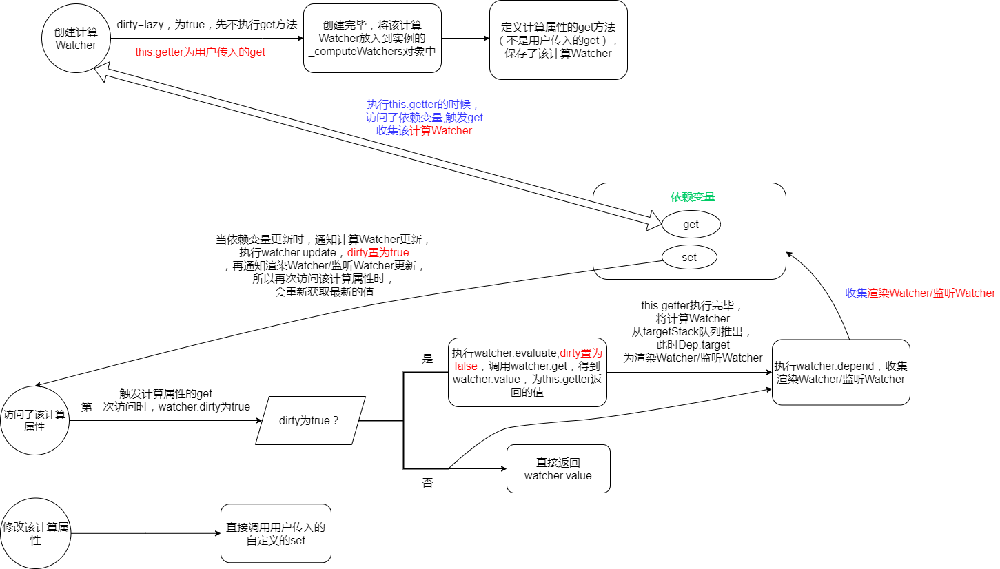
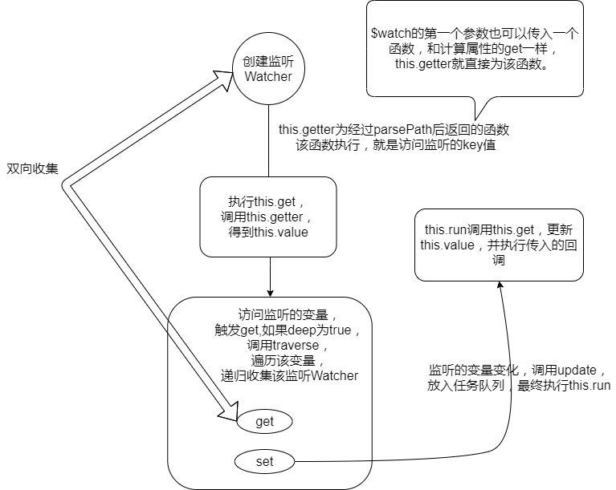
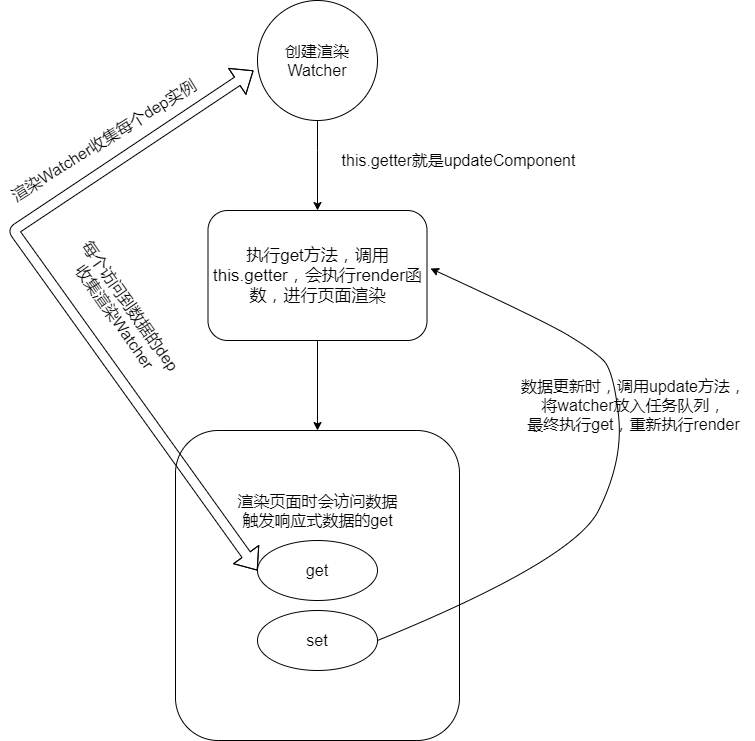

# 响应式原理  
**响应式原理的核心：通过Object.defineProperty对数据处理以及Observer，Watcher，Dep 这三个类的定义**

::: tip 文件目录
/src/core/observer/index.js  
:::
## observe  
响应式处理的入口，为响应式数据创建观察者实例

```js
export let shouldObserve: boolean = true;
// 可以理解为数据观测的开关。这个是控制是否为对象创建Observer实例，也就是挂载__ob__，但是并不妨碍直接使用defineReactive进行响应式处理
export function toggleObserving(value: boolean) {
  shouldObserve = value;
}

export function observe(value: any, asRootData: ?boolean): Observer | void {
  // 如果不是对象或者是VNode，直接返回
  if (!isObject(value) || value instanceof VNode) {
    return;
  }
  let ob: Observer | void;
  // __ob__为当前数据绑定的观察者Observe对象，如果存在了，则不必重复绑定
  if (hasOwn(value, "__ob__") && value.__ob__ instanceof Observer) {
    ob = value.__ob__;
  } else if (
    shouldObserve &&
    !isServerRendering() &&
    (Array.isArray(value) || isPlainObject(value)) &&
    Object.isExtensible(value) &&
    !value._isVue
  ) {
    /* 
    满足所有条件才会创建观察者实例
    1.shouldObserve为true
    2.不是服务端渲染
    3.为数组或对象
    4.可扩展（是否可以在它上面添加新的属性）
    5._isVue为true,（_isVue在_init()方法里设置为true），即传入的value不能是vue实例
     */
    ob = new Observer(value);
  }
  if (asRootData && ob) {
    // observe传入的第二个参数为true才会执行
    ob.vmCount++;
  }
  return ob;
}
```

## Observer类
Observer类会创建一个观察者实例对象，添加到被观察的__ob__属性上
1. 被观察的对象如果对象，遍历该对象，使用defineReactive方法进行处理
2. 被观察的对象如果是数组，对该数组的原型方法进行了处理，并对该数组继续递归进行响应式处理
```js
export class Observer {
  value: any; //传入的值，数组或者对象
  dep: Dep; //Dep实例，依赖管理（收集watcher）
  vmCount: number; // 该实例被调用的次数

  constructor(value: any) {
    this.value = value;
    this.dep = new Dep();
    this.vmCount = 0;
    // 将Observer实例挂到__ob__上，且该key值不可遍历
    def(value, "__ob__", this);
    if (Array.isArray(value)) {
      // 如果是数组，对数组原型重新指定，指向新改修的arrayMethods
      if (hasProto) {
        //这个判断是做兼容处理
        protoAugment(value, arrayMethods);
      } else {
        copyAugment(value, arrayMethods, arrayKeys);
      }
      // 数组的响应式处理
      this.observeArray(value);
    } else {
      // 对象的响应式处理
      this.walk(value);
    }
  }

  /*
    对象响应式处理
    初始化实例时会对属性执行 getter/setter 转化，
    后期向对象中新添加的key是不会进行响应式处理的
    所以必须在data对象上存在的属性才能将它转换为响应式的
   */
  walk(obj: Object) {
    const keys = Object.keys(obj);
    for (let i = 0; i < keys.length; i++) {
      // 遍历对象，进行响应式处理（响应式核心）
      defineReactive(obj, keys[i]);
    }
  }

  /**
   遍历数组，对数组里的对象进行响应式处理
   所以如官网所说
   Vue 不能检测以下数组的变动：
      1.当你利用索引直接设置一个数组项时，例如：vm.items[indexOfItem] = newValue
      2.当你修改数组的长度时，例如：vm.items.length = newLength
   */
  observeArray(items: Array<any>) {
    for (let i = 0, l = items.length; i < l; i++) {
      // observe方法内，如果数组内的元素不是对象或数组，会直接返回
      observe(items[i]);
    }
  }
}


/**
  改写数组的7个方法添加到目标数组上
 */
function protoAugment(target, src: Object) {
  // 直接添加到数组的__proto__上
  target.__proto__ = src;
  /* eslint-enable no-proto */
}

/**
  改写数组的7个方法添加到目标数组上
 */
/* istanbul ignore next */
function copyAugment(target: Object, src: Object, keys: Array<string>) {
  for (let i = 0, l = keys.length; i < l; i++) {
    const key = keys[i];
    // 直接将对应的7个方法，添加到目标数组上
    def(target, key, src[key]);
  }
}
```
### 数组的处理
因为Object.defineProperty不支持对数组的操作，所以vue通过改写数组的原生方法实现对数组的响应式处理
```js
const arrayProto = Array.prototype
// 创建空对象，原型指向Array.prototype
export const arrayMethods = Object.create(arrayProto)

const methodsToPatch = [
  'push',
  'pop',
  'shift',
  'unshift',
  'splice',
  'sort',
  'reverse'
]

/**
 操作数组的七个方法，将这7个方法进行改写到arrayMethods对象里
 */
methodsToPatch.forEach(function (method) {
  // 缓存原生方法的值
  const original = arrayProto[method]
  def(arrayMethods, method, function mutator (...args) {
    const result = original.apply(this, args)
    const ob = this.__ob__ //当操作该数组时，拿到该数组的观察者实例
    let inserted //新插入的值
    // 下面三个方法会插入新的值
    switch (method) {
      case 'push':
      case 'unshift':
        inserted = args
        break
      case 'splice':
        inserted = args.slice(2)
        break
    }
    // 对新插入的元素做响应式处理 
    if (inserted) ob.observeArray(inserted)
    // 通知依赖更新
    ob.dep.notify()
    return result
  })
})
```

## defineReactive
通过Object.defineProperty来定义被观察对象的get和set
1. 当读取数据时触发get，进行依赖（watcher）收集
2. 当修改数据时触发set，进行通知更新
```js
/**
 响应式处理
 */
export function defineReactive(
  obj: Object,
  key: string,
  val: any,
  customSetter?: ?Function,  //对inject,props,$attrs等数据进行响应式处理时，传递的函数，如果修改了值，会调用该回调函数，因为数据是只读的，所以不应该修改
  shallow?: boolean //shallow为true，表示浅响应式处理，只对对象第一层进行响应式处理
) {
  // 闭包，保存每个数据的dep实例
  // 为每个数据，创建dep实例
  const dep = new Dep();

  // 获取属性的描述符
  const property = Object.getOwnPropertyDescriptor(obj, key);
  if (property && property.configurable === false) {
    // 如果configurable为false,直接返回
    return;
  }

  // 如果自定义的get和set存在，使用自定义的
  const getter = property && property.get;
  const setter = property && property.set;
  if ((!getter || setter) && arguments.length === 2) {
    // 如果setter存在且只传了两个参数，val直接为对象取值
    val = obj[key];
  }

  // 如果该属性是对象或数组，对该属性内的元素处理成响应式，进行递归
  // childOb为返回的观察者实例，就是给当前值绑定的__ob__属性
  let childOb = !shallow && observe(val);
  Object.defineProperty(obj, key, {
    enumerable: true,
    configurable: true,
    // get 拦截对 obj[key] 的读取操作
    get: function reactiveGetter() {
      const value = getter ? getter.call(obj) : val;
      // 依赖收集
      if (Dep.target) {
        dep.depend();
        if (childOb) {
          // 如果childOb存在，给当前值绑定的__ob__属性的dep收集watcher
          childOb.dep.depend();
          if (Array.isArray(value)) {
            // 子属性如果是数组，对数组里的对象进行依赖收集
            dependArray(value);
          }
        }
      }
      return value;
    },
    // 拦截赋值操作
    set: function reactiveSetter(newVal) {
       
      const value = getter ? getter.call(obj) : val;
      // 如果新值和旧值相等或者(newVal和value是NaN)，直接返回，不进行响应式处理
      if (newVal === value || (newVal !== newVal && value !== value)) { 
        return;
      }
      /* eslint-enable no-self-compare */
      if (process.env.NODE_ENV !== "production" && customSetter) {
        // 调用传入的customSetter
        customSetter();
      }
      // #7981: for accessor properties without setter
      if (getter && !setter) return;
      if (setter) {
        // 如果自定义的setter存在，执行自定义的
        setter.call(obj, newVal);
      } else {
        // 将val赋值成新增，当再次访问时，触发get需要用到val，保证val是最新的
        val = newVal;
      }
      // 将新值进行响应式处理
      childOb = !shallow && observe(newVal);
      // 通知依赖进行更新
      dep.notify();
    },
  });
}

/**
  为什么需要dependArray？
  因为observe(obj)方法，传入的obj，对于最外层的是没有进行defineProperty的
  比如vm._data = {
     obj:{
        xxx:"xxx"
     }
     arr[
       {
         obj:{
           "name":"xxx"
          }
       }
     ]
  }
  _data属性本身是没有进行defineProperty处理的，无法收集依赖
  只有内部的属性进行了defineProperty处理，然后会通过get进行依赖收集
  虽然vm._data上也挂载了__ob__属性，但是他的dep并没有收集watcher
  数组里的对象也是同样的道理，最外一层（比如arr里第一个元素）没有办法收集依赖，里面的元素是可以收集依赖的
  dependArray确保了数组里对象的最外一层的__ob__的dep收集了依赖，当对该对象使用Vue.set添加属性时，可以通知watcher进行更新
  如果数组元素里的值是数组或者对象，需要递归去为内部的元素收集相关的依赖
 */
function dependArray(value: Array<any>) {
  for (let e, i = 0, l = value.length; i < l; i++) {
    e = value[i];
    e && e.__ob__ && e.__ob__.dep.depend(); //为属性添加依赖
    if (Array.isArray(e)) {
      // 如果是数组继续递归
      dependArray(e);
    }
  }
}
```
## Dep类  
每个被观察的数据，都会有一个对应的dep实例
1. 当访问该数据时，dep实例会收集当前watcher，推入subs数组
2. 当修改该数据时，dep实例会遍历收集的所有watcher进行更新
::: tip 文件目录
/src/core/observer/dep.js  
:::

```js
let uid = 0
/**
 每个进行响应式处理的数据都会创建一个dep实例
 */
export default class Dep {
  static target: ?Watcher;
  //target静态属性， Dep.target = 当前正在执行的 watcher，同一时间只会有一个watcher 在执行
  id: number; 
  // dep实例的id
  subs: Array<Watcher>;
  // dep实例收集的watcher

  constructor () {
    this.id = uid++
    this.subs = []
  }

  // 往dep实例添加watcher
  addSub (sub: Watcher) {
    this.subs.push(sub)
  }

  // 移除收集的watcher
  removeSub (sub: Watcher) {
    remove(this.subs, sub)
  }

  depend () {
    if (Dep.target) {
      // 向当前watcher添加dep实例
      Dep.target.addDep(this)
    }
  }

  // 通知dep实例收集的所有watcher进行更新
  notify () {
    // stabilize the subscriber list first
    // 当前dep实例收集的所有watcher
    const subs = this.subs.slice()
    if (process.env.NODE_ENV !== 'production' && !config.async) {
      // subs aren't sorted in scheduler if not running async
      // we need to sort them now to make sure they fire in correct
      // order
      // 如果不是全局配置的async为false，则为同步执行，确保watcher的执行顺序，从父到子
      subs.sort((a, b) => a.id - b.id)
    }
    for (let i = 0, l = subs.length; i < l; i++) {
      // 遍历所有watcher，执行watcher的update方法
      subs[i].update()
    }
  }
}
```

### pushTarget
```js
// 为什么需要targetStack来管理？
// https://segmentfault.com/q/1010000010095427/a-1020000010103282
Dep.target = null
const targetStack = []

export function pushTarget (target: ?Watcher) {
  // 将watcher推入栈中
  targetStack.push(target)
  //更新当前watcher   
  Dep.target = target
}

```
### popTarget
```js
export function popTarget () {
  // 将watcher推出栈中
  targetStack.pop()
  //更新当前watcher，为栈顶的watcher
  Dep.target = targetStack[targetStack.length - 1]
}
```

## Watcher类
三个地方创建了Watcher
1. 计算Watcher（computedWatcher）：处理computed选项时创建的watcher实例  
```js
 var computedWatcherOptions = { lazy: true };
 new Watcher(
       vm,
       getter || noop, 
       noop,
       computedWatcherOptions
     );
```
**执行流程**  
<div style="overflow:auto">

</div>  

**处理computed选项时** 
- 创建计算Watcher，先不执行传入的get方法。
- 当访问计算属性时，执行get方法获取value值，第一次访问value会进行缓存，重复访问会拿到缓存的值
- 同时依赖的变量会收集该计算Watcher 
- 当依赖变量更新时，触发计算Watcher的update方法，更新获取最新的值，重复上述过程
2. 监听Watcher：处理watch选项时，$watch方法创建的watcher实例
```js
    options.user = true;
    new Watcher(vm, expOrFn, cb, options);
```
**执行流程**  


**处理watch选项时** 
- 创建监听Watcher，执行get方法，获取value值，同时依赖的变量会收集该监听Watcher
- 当监听的变量更新时，调用监听Watcher的update方法，更新获取最新的值，之前的值就是旧的了
- 再调用传入的回调

3. 渲染Watcher：mountComponent方法中，每个组件执行$mount时，创建了一个渲染watcher实例
```js
    new Watcher(vm, updateComponent, noop, {
          before: function before () {
            if (vm._isMounted && !vm._isDestroyed) {
              callHook(vm, 'beforeUpdate');
            }
          }
    }, true);
```
**执行流程**  



**执行顺序**  
从选项处理的顺序可知，$mount时才创建了渲染Watcher，所以一个vue实例中3种Watcher创建的顺序为：1.计算Watcher 2.监听Watcher 3.渲染Watcher。渲染Watcher的id值比监听Watcher和计算Watcher的id要大

::: tip 文件目录
/src/core/observer/watcher.js  
:::

```js
let uid = 0
export default class Watcher {
  vm: Component;
  expression: string; //传入的expOrFn的字符串形式，报错需要用到
  cb: Function;  //传入的回调，渲染Watcher和监听Watcher用到
  id: number;    //Watcher实例的id，代表创建的顺序
  deep: boolean;  //watch的deep选项
  user: boolean;  //监听Watcher传入为true
  lazy: boolean;  //computedWatcher传入的lazy参数，为true
  sync: boolean;  //
  dirty: boolean; //计算属性缓存的原理
  active: boolean; //创建watcher实例时就赋值为true，为false，说明该watcher实例已经拆除
  deps: Array<Dep>; //newDeps的拷贝，当数据变化时，用来进行比较
  newDeps: Array<Dep>; //访问变量时进行依赖收集，将dep实例添加进来，方法get执行完后，清空
  depIds: SimpleSet; //newDepIds的拷贝，当数据变化时，用来进行比较
  newDepIds: SimpleSet; //访问变量时进行依赖收集，将dep实例添加进来，方法get执行完后，清空
  before: ?Function; //渲染watcher传入的before方法，在更新前执行beforeUpdate钩子，用户也可以传入自定义的before方法
  getter: Function;
  value: any; 

  constructor (
    vm: Component,
    expOrFn: string | Function, //$watch传入的观察的key("a.b.c"的形式)或者传入的函数
    cb: Function,
    options?: ?Object,
    isRenderWatcher?: boolean //是否是渲染watcher
  ) {
    this.vm = vm
    if (isRenderWatcher) {
      // 将渲染watcher实例,挂载到vm._watcher
      vm._watcher = this
    }
    // 每个实例创建的所有watcher都推入到_watchers数组中
    vm._watchers.push(this)
    // options
    if (options) {
      this.deep = !!options.deep
      this.user = !!options.user
      this.lazy = !!options.lazy
      this.sync = !!options.sync
      this.before = options.before
    } else {
      // 没传默认为false
      this.deep = this.user = this.lazy = this.sync = false
    }
    this.cb = cb //$watch监听的回调函数用到
    this.id = ++uid // uid for batching
    this.active = true
    this.dirty = this.lazy // for lazy watchers
    this.deps = [] 
    this.newDeps = [] 
    this.depIds = new Set() 
    this.newDepIds = new Set() 
    this.expression = process.env.NODE_ENV !== 'production'
      ? expOrFn.toString()
      : ''
    if (typeof expOrFn === 'function') {
      // expOrFn是函数
      this.getter = expOrFn
    } else {
      // $watch传入的观察的key("a.b.c"的形式)
      // this.getter在下面get中执行时，对key进行了访问，触发get，dep实例收集监听Watcher
      this.getter = parsePath(expOrFn)
      if (!this.getter) {
        this.getter = noop
        // getter不存在，说明watch监控的key值，解析不了报错
        process.env.NODE_ENV !== 'production' && warn(
          `Failed watching path: "${expOrFn}" ` +
          'Watcher only accepts simple dot-delimited paths. ' +
          'For full control, use a function instead.',
          vm
        )
      }
    }
    /*
    this.lazy为true，说明是computedWatcher，先不执行this.get()，当访问计算属性时，会调用evaluate方法执行this.get
    渲染Watcher和监听Watcher则在创建时就执行了this.get()
    */
    this.value = this.lazy
      ? undefined
      : this.get()
  }

```

### get 
**this.getter的情况**
1. 渲染Watcher传入的updateComponent，会执行render函数
2. 解析监听Watcher传入观察的key值，返回的函数
3. 计算Watcher传入的get方法

```js
 /**
   会执行this.getter，触发依赖收集
    当更新时又会执行get方法，又会重新收集依赖
    为什么要重新收集依赖？
    因为触发更新说明有响应式数据被更新了，这些新的响应式数据还没有收集依赖，
    在重新render的过程，访问到新的响应式数据需要收集watcher
   */
  get () {
    // 将当前watcher赋值给Dep.target
    pushTarget(this)
    let value
    const vm = this.vm
    try {
      // 得到value值,(watch观察的值，computed的get返回的值)
      value = this.getter.call(vm, vm)
    } catch (e) {
      if (this.user) {
        handleError(e, vm, `getter for watcher "${this.expression}"`)
      } else {
        throw e
      }
    } finally {
      if (this.deep) {
        //this.deep为true，递归 
        traverse(value)
      }
      popTarget()
      this.cleanupDeps()
    }
    return value
  }


  const seenObjects = new Set()
  /**
  traverse对一个数组或对象做深层递归遍历，因为遍历过程中就是对一个子对象的访问，
  会触发它们的 getter 过程，这样就可以收集到依赖watcher实例
  */
  export function traverse (val: any) {
    _traverse(val, seenObjects)
    seenObjects.clear() //清空Set中的元素
  }

  function _traverse (val: any, seen: SimpleSet) {
    let i, keys
    const isA = Array.isArray(val)
    if ((!isA && !isObject(val)) || Object.isFrozen(val) || val instanceof VNode) {
      // 不是数组且不是对象，是对象但不可配置，Vnode实例
      // 满足上面3个条件之一，直接返回
      return
    }
    if (val.__ob__) {
      // 如果存在__ob__观察者实例
      const depId = val.__ob__.dep.id
      if (seen.has(depId)) {
        // 有了就不添加，避免重复收集依赖，直接返回
        return
      }
      // 将dep实例的Id推入到Set集合中
      seen.add(depId)
    }
    if (isA) {
      // 是数组，继续递归
      i = val.length
      while (i--) _traverse(val[i], seen)
    } else {
      // 是对象。继续递归对象
      keys = Object.keys(val)
      i = keys.length
      while (i--) _traverse(val[keys[i]], seen)
    }
  }
```

### addDep

```js
/**
   添加dep实例，并将自己添加到dep实例中，是个双向的过程
   */
  addDep (dep: Dep) {
    const id = dep.id
    if (!this.newDepIds.has(id)) {
      // newDepIds里没有这个id
      // 将dep实例的id添加到newDepIds
      this.newDepIds.add(id)
      // 将dep实例添加到newDeps
      this.newDeps.push(dep)
      if (!this.depIds.has(id)) {
        //depIds里没有这个depId，才会向dep实例添加该watcher实例，防止重复添加
        dep.addSub(this)
      }
    }
  }
```

### cleanupDeps  
```js
/**
   * 上一次收集的dep实例，但在最新的一次更新时，没有进行收集的dep需要清除掉
   */
  cleanupDeps () {
    // 第一次创建时，deps没有值，不会循环
    let i = this.deps.length
    while (i--) {
      // 遍历deps
      const dep = this.deps[i]
      // 新收集的dep实例与旧收集的dep实例进行比较
      // 如果旧的不在新的中，说明页面没有对该变量进行访问
      if (!this.newDepIds.has(dep.id)) {
        // 将该变量收集的当前watcher移除
        dep.removeSub(this)
      }
    }
    //将newDepIds赋值给depIds，并清空newDepIds
    let tmp = this.depIds
    this.depIds = this.newDepIds
    this.newDepIds = tmp
    this.newDepIds.clear()
    tmp = this.deps
    //将newDeps赋值给deps，并清空newDeps
    this.deps = this.newDeps
    this.newDeps = tmp
    this.newDeps.length = 0
  }
```
cleanupDeps的作用是什么？  
某个数据在上一次页面渲染时，对它进行了访问，收集了渲染watcher。当下次更新时，该数据隐藏了，页面没有访问该数据，需要将上一次收集的渲染watcher进行剔除，不然改变了该数据，即使没有在页面中访问，也会触发渲染watcher更新，造成性能浪费

::: tip 
示例
:::

```html
<!DOCTYPE html>
<html lang="en">
  <head>
    <meta charset="UTF-8" />
    <meta http-equiv="X-UA-Compatible" content="IE=edge" />
    <meta name="viewport" content="width=device-width, initial-scale=1.0" />
    <title>Document</title>
  </head>
  <script src="../dist/vue.js"></script>
  <body>
    <div id="app">
      <div v-if="flag">{{msg}}</div>
      <button @click="changeMsg">changeMsg</button>
      <button @click="toggle">toggle</button>
    </div>
    <div id="extend1"></div>
  </body>
  <script>
    new Vue({
      el: "#app",
      data() {
        return {
          flag: true,
          msg: "msg",
        };
      },
      methods: {
        changeMsg() {
          this.msg = "new msg";
        },
        toggle() {
          this.flag = !this.flag;
        },
      },
    });
  </script>
</html>
```

### update

```js
  /**
   根据 watcher 配置项，决定同步还是异步更新，一般是异步
   */
  update () {
    /* istanbul ignore else */
    if (this.lazy) {
      // 如果this.lazy存在，说明是computedWatcher，将dirty设置为true，访问计算属性时，重新获取最新的值
      this.dirty = true
    } else if (this.sync) {
       // this.sync为true，则同步执行（在使用 vm.$watch 或者 watch 选项时可以传一个 sync 选项，官方文档没说明），
      this.run()
    } else {
      // 异步执行
      // 更新时一般都这里，将 watcher 放入 watcher 队列
      queueWatcher(this)
    }
  }
```

### run
```js
/**
   进行更新时，在任务队列里，会被flushSchedulerQueue调用
   */
  run () {
    if (this.active) {
      // 重新收集依赖，并得到最新的value
      const value = this.get()
      if (
        // 新值不等于旧值
        value !== this.value ||
        // 新值为对象或数组
        isObject(value) ||
        // deep为true
        this.deep
      ) {
        const oldValue = this.value
        // this.value拿到新值
        this.value = value
        if (this.user) {
          // 只有监听Watcher的user为true，因为需要调用用户传入的回调，需要进行错误处理
          const info = `callback for watcher "${this.expression}"`
          // 进行错误处理，里面会执行回调，如果有报错，会进行错误拦截
          invokeWithErrorHandling(this.cb, this.vm, [value, oldValue], this.vm, info)
        } else {
          // 非监听Watcher执行回调，this.cb都是noop函数
          this.cb.call(this.vm, value, oldValue)
        }
      }
    }
  }
```

### evaluate
```js
/**
   evaluate执行，得到value值，在计算属性中用到
   */
  evaluate () {
    this.value = this.get()
    this.dirty = false
  }
```

### depend  

```js
/**
   * 遍历所有dep实例，添加组件的渲染watcher/监听Watcher，在计算属性中用到
   */
  depend () {
    let i = this.deps.length
    while (i--) {
      this.deps[i].depend()
    }
  }

```
depend可以确保计算Watcher的依赖变量可以收集渲染Watcher，如上面所示，还有一种情况就是$watch监听的key值是计算属性时，可以让依赖变量收集监听Watcher，示例  
  
**监听的是计算属性，计算属性没有做响应式处理，那计算属性依赖的变量如何收集这个监听Watcher的？**  
当处理watch选项时，因为是监听的计算属性，监听Watcher的get方法中会访问计算属性,计算Watcher的get执行，此时targetStack中为[监听Watcher,计算Watcher]，get执行完，将计算Watcher从targetStack推出，然后执行depend，依赖变量收集监听Watcher，所以依赖变量更新时，会通知监听Watcher更新。:point_right: [计算Watcher流程](./observe.html#watcher类)
```html
<!DOCTYPE html>
<html lang="en">
  <head>
    <meta charset="UTF-8" />
    <meta http-equiv="X-UA-Compatible" content="IE=edge" />
    <meta name="viewport" content="width=device-width, initial-scale=1.0" />
    <title>Document</title>
  </head>
  <script src="../dist/vue.js"></script>
  <body>
    <div id="app">
      <!-- <div>{{cp}}</div> -->
      <input type="button" value="change" @click="changeMsg" />
    </div>
    <div id="extend1"></div>
  </body>
  <script>
    new Vue({
      el: "#app",
      computed: {
        cp() {
          return this.msg;
        },
      },
      data() {
        return {
          msg: "msg",
        };
      },
      watch: {
        cp: function (nv, ov) {
          console.log(nv, ov);
        },
      },
      methods: {
        changeMsg() {
          this.msg = "new msg";
        },
      },
      mounted() {
        console.log(this);
      },
    });
  </script>
</html>
```
### teardown
```js
  /**
   收集了该watcher的dep实例，都对它进行删除
   */
  teardown () {
    if (this.active) {
      // remove self from vm's watcher list
      // this is a somewhat expensive operation so we skip it
      // if the vm is being destroyed.
      if (!this.vm._isBeingDestroyed) {
        // 删除储存在vm._watchers数组中当前watcher
        remove(this.vm._watchers, this)
      }
      let i = this.deps.length
      while (i--) {
        // 收集了该watcher的所有dep实例，都对该watcher进行删除
        this.deps[i].removeSub(this)
      }
      // active置为false
      this.active = false
    }
  }
}
```

## Q&A
* **computed 和 watch 的区别？**   
computed和watch本质是一样的，都是创建了对应的watcher实例，只不过是表现的形式不一样，导致了使用场景有区别。  
computed是用来获取值的，且依赖变量不变时，多次访问计算属性，是可以取到缓存值的。  
watch是用来监听值的变化的，当值变化时，会触发回调函数，回调函数中可以执行异步操作。  
* **computed 和 methods 的区别？**  
computed可以进行缓存，多次访问计算属性，只有第一次会执行计算过程，通过watcher.dirty属性控制。  
method调用几次，则会执行几次。  
* **watch 和 methods 的区别？**  
两者不是一种东西，没啥可比较的