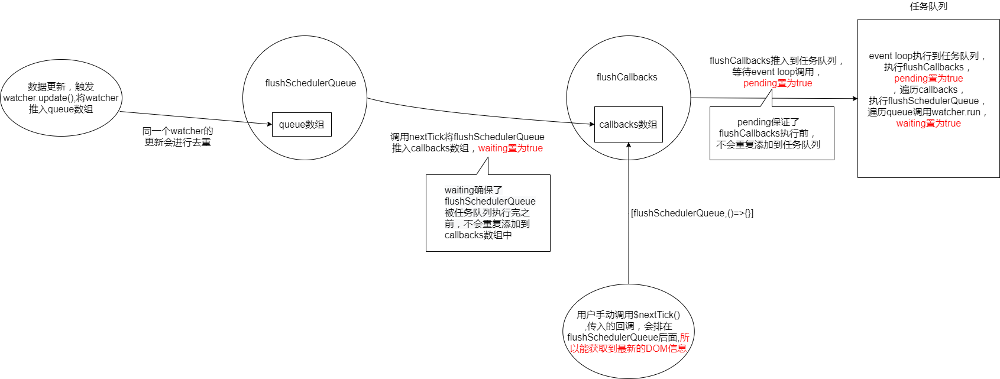

# 异步队列
::: tip 文件目录
/src/core/observer/scheduler.js  
:::
```js
export const MAX_UPDATE_COUNT = 100

const queue: Array<Watcher> = [] //存放watcher的队列
const activatedChildren: Array<Component> = []
let has: { [key: number]: ?true } = {} //是一个对象，存放watcher.id，用来过滤watcher,当watcher已经存在,不会重复添加
let circular: { [key: number]: number } = {}
let waiting = false  //waiting为true，表示将flushSchedulerQueue函数推入到callbacks数组中，任务执行完毕，才会再次置为false。
// waiting保证了flushSchedulerQueue在等待被执行的过程中，不会重复推入到callbacks数组
let flushing = false //flushing为true，表示watcher队列正在执行更新，任务执行完毕，才会再次置为false
let index = 0  //正在执行的watcher的索引
```

## resetSchedulerState

```js
/**
当队列执行完毕，重置状态
 */
function resetSchedulerState () {
  index = queue.length = activatedChildren.length = 0
  has = {}
  if (process.env.NODE_ENV !== 'production') {
    circular = {}
  }
  waiting = flushing = false
}
```
## flushSchedulerQueue
```js
/**
flushSchedulerQueue会通过nextTick方法添加到callbacks数组
 */
function flushSchedulerQueue () {
  currentFlushTimestamp = getNow() //获取当前队列执行的时间戳
  flushing = true  //将flushing置为true，表示队列正在执行
  let watcher, id
  /*
  将队列排序（升序），保证
     1、组件的更新顺序为从父级到子级，因为父组件总是在子组件之前被创建
     2、一个组件的用户 watcher（监听Watcher和computedWatcher） 在其渲染 watcher 之前被执行，因为用户 watcher 先于 渲染 watcher 创建
     3、如果一个组件在其父组件的 watcher 执行期间被销毁，则它的 watcher 可以被跳过
    排序以后在刷新队列期间新进来的 watcher 也会按顺序放入队列的合适位置
  */
  queue.sort((a, b) => a.id - b.id)

  // 遍历watcher队列，直接使用了 queue.length，动态计算队列的长度，因为在执行的时候，可能会有新的watcher推入队列
  for (index = 0; index < queue.length; index++) {
    watcher = queue[index]
    if (watcher.before) {
      // 执行watcher的before方法，比如渲染Watcher传入的before调用了beforeUpdate生命周期钩子
      watcher.before()
    }
    id = watcher.id
    // 将缓存的watcherId清除，可以向队列中继续推入当前watcher
    has[id] = null
    // 执行run方法，进行更新
    watcher.run()
    // in dev build, check and stop circular updates.
    if (process.env.NODE_ENV !== 'production' && has[id] != null) {
      // 在开发环境中，会计算队列中，同一watcher进行更新的次数，如果大于100次会报错
      circular[id] = (circular[id] || 0) + 1
      if (circular[id] > MAX_UPDATE_COUNT) {
        warn(
          'You may have an infinite update loop ' + (
            watcher.user
              ? `in watcher with expression "${watcher.expression}"`
              : `in a component render function.`
          ),
          watcher.vm
        )
        break
      }
    }
  }

  // keep copies of post queues before resetting state
  const activatedQueue = activatedChildren.slice()
  const updatedQueue = queue.slice()

  // 执行完毕，重置状态
  resetSchedulerState()

  // 执行生命周期钩子
  callActivatedHooks(activatedQueue)
  callUpdatedHooks(updatedQueue)

  // devtool hook
  /* istanbul ignore if */
  if (devtools && config.devtools) {
    devtools.emit('flush')
  }
}
```

## queueWatcher

```js
/**
  queueWatcher将watcher放入watcher 队列,相同的watcher不会重复添加
 */
export function queueWatcher (watcher: Watcher) {
  // 拿到watcher的id
  const id = watcher.id
  // 刚推入watcher时，has对象作的键值不存在该watcher.id，has[id] = undefined，而undefined == null所以成立
  if (has[id] == null) {
     // 缓存 watcher.id，用于判断 watcher 是否已经入队,防止重复添加
    has[id] = true
    if (!flushing) {
      // watcher队列没有执行
      // watcher直接入队
      queue.push(watcher)
    } else {
      // watcher队列正在执行
      /* 从队列末尾开始倒序选择插入的位置,即将当前 watcher 放入已排序的队列中，且队列仍是有序的
        例如：
        当queue队列中的watcher为[1,3,5,6,7]，当前已经执行到id为5的watcher，此时index=2，又推入新的watcher，id为2。
          i > index，保证了新插入的watcher，位置一定会在当前执行的watcher后面,才能执行到插入的watcher
          queue[i].id > watcher.id，保证了新插入的watcher，插入后的未执行的部分循序仍然是升序的
          最终结果为[1,3,5,2,6,7]
      */
      let i = queue.length - 1
      while (i > index && queue[i].id > watcher.id) {
        i--
      }
      queue.splice(i + 1, 0, watcher)
    }

    if (!waiting) {
      // waiting为false,说明队列执行完毕
      waiting = true
      if (process.env.NODE_ENV !== 'production' && !config.async) {
        // 如果config.async为false，则同步执行
        // 直接调用flushSchedulerQueue，一般不会走这
        flushSchedulerQueue()
        return
      }
      //调用nextTick方法，添加到callbacks数组，最终会在浏览器的任务队列中执行
      nextTick(flushSchedulerQueue)
    }
  }
}
```
::: tip 文件目录
/src/core/observer/next-tick.js  
:::
```js
export let isUsingMicroTask = false

const callbacks = []
let pending = false
```
## nextTick
```js
export function nextTick (cb?: Function, ctx?: Object) {
  let _resolve
  // 向callbacks推入包装处理过的回调函数，在任务队列中调用
  callbacks.push(() => {
    if (cb) {
      // 回调存在，执行回调
      try {
        cb.call(ctx)
      } catch (e) {
        // 处理错误
        handleError(e, ctx, 'nextTick')
      }
    } else if (_resolve) {
      // 回调不存在，执行_resolve(), _resolve在下面被赋值了
      _resolve(ctx)
    }
  })
  if (!pending) {
    /*
     如果 pending 为 true，则表示浏览器的任务队列中已经放入了 flushCallbacks 函数,正在等待被执行
     pending 为 false 说明事件循环已经调用了该微任务 
     执行 flushCallbacks 函数时，pending 会被再次置为 false，表示下一个 flushCallbacks 函数可以进入
     浏览器的任务队列了
     pending保证了flushCallbacks执行前，不会重复添加到任务队列
    */
    pending = true
    timerFunc()
  }
  // $flow-disable-line
  if (!cb && typeof Promise !== 'undefined') {
    // 当不传回调函数时且浏览器支持Promise的，返回一个Promise，
    // 可以使用this.$nextTick().then(()=>{})的形式或者await this.$nextTick()的形式
    return new Promise(resolve => {
      // 将resolve赋值给_resolve
      _resolve = resolve
    })
  }
```

**所以nextTick支持三种写法**
1. ```this.$nextTick(()=>{ do something })```
2. ```this.$nextTick().then(()=>{ do something })```
3. ```await this.$nextTick();```

## timerFunc

```js
// timerFunc的作用，就是将flushCallbacks函数放入浏览器的异步任务队列中
let timerFunc
/* istanbul ignore next, $flow-disable-line */
if (typeof Promise !== 'undefined' && isNative(Promise)) {
  // 支持Promise
  const p = Promise.resolve()
  timerFunc = () => {
    // 将flushCallbacks放入微任务队列
    p.then(flushCallbacks)
    /**
     * 在有问题的UIWebViews中，Promise.then不会完全中断，但是它可能会陷入怪异的状态，
     * 在这种状态下，回调被推入微任务队列，但队列没有被刷新，直到浏览器需要执行其他工作，例如处理一个计时器。
     * 因此，我们可以通过添加空计时器来“强制”刷新微任务队列。
     */
    if (isIOS) setTimeout(noop)
  }
  isUsingMicroTask = true
} else if (!isIE && typeof MutationObserver !== 'undefined' && (
  isNative(MutationObserver) ||
  // PhantomJS and iOS 7.x
  MutationObserver.toString() === '[object MutationObserverConstructor]'
)) {
  // 不支持Promise，使用MutationObserver
  let counter = 1
  // MutationObserver的回调函数会进入微任务队列
  const observer = new MutationObserver(flushCallbacks)
  // 创建一个节点
  const textNode = document.createTextNode(String(counter))
  // 观察该节点内容变化时，会执行MutationObserver传入的回调（flushCallbacks方法）
  observer.observe(textNode, {
    characterData: true
  })
  timerFunc = () => {
    // 更新节点内容，触发回调
    counter = (counter + 1) % 2
    textNode.data = String(counter)
  }
  isUsingMicroTask = true
} else if (typeof setImmediate !== 'undefined' && isNative(setImmediate)) {
  // 不支持MutationObserver，使用setImmediate，高版本IE 和 Edge 才支持
  // setImmediate其实已经是一个宏任务了，但仍然比 setTimeout 要好
  timerFunc = () => {
    setImmediate(flushCallbacks)
  }
} else {
  // 都不支持，只能使用setTimeout
  timerFunc = () => {
    setTimeout(flushCallbacks, 0)
  }
}
```
## flushCallbacks
```js
// flushCallbacks会添加到浏览器任务队列中
function flushCallbacks () {
  pending = false
  // 复制一遍callbacks
  const copies = callbacks.slice(0)
  // 把 原来 callbacks 清空
  callbacks.length = 0
  for (let i = 0; i < copies.length; i++) {
    // 遍历执行callbacks里的回调函数
    copies[i]()
  }
}
```


## Q&A
**执行流程**
<div style="overflow:auto">

</div>  
关于event loop指路：:point_right: <a href="https://juejin.cn/post/6844903512845860872#heading-0" target="_blank" rel="noopener noreferrer" >事件循环</a>:point_right:<a href="https://github.com/aooy/blog/issues/5" target="_blank" rel="noopener noreferrer" >事件循环与浏览器渲染时机</a>  

* **下面的示例，为什么浏览器不会渲染？**  

1. 可以按照上面的流程走一下，```this.show = false```和手动调用```nextTick```，callbacks数组为```[flushSchedulerQueue,()=>{this.show = true}]```,当event loop执行到microTasks队列时，调用flushSchedulerQueue，执行watcher.run（也就是show收集的渲染Watcher更新），对DOM节点进行更新。flushSchedulerQueue执行完毕，调用nextTick传入的回调，show变为了true，又会重复一遍上面的过程，**此时event loop还没有结束，向这一轮event loop的microTasks队列添加该任务**，继续往下执行，microTasks队列清空，浏览器判断DOM节点没有变化，所以才不会进行渲染  
:::warning 注意
DOM节点更新与浏览器重新渲染是两码事
:::
2. 如果将nextTick替换成setTimeout，会进行两次event loop，所以看上去屏幕会闪一下    

**一般来说event loop循环一次，浏览器会进行更新渲染，这取决于是否修改了dom和浏览器觉得是否有必要**  
::: tip 
示例
:::
```html
<!DOCTYPE html>
<html lang="en">
  <head>
    <meta charset="UTF-8" />
    <meta http-equiv="X-UA-Compatible" content="IE=edge" />
    <meta name="viewport" content="width=device-width, initial-scale=1.0" />
    <title>Document</title>
  </head>
  <script src="../dist/vue.js"></script>
  <body>
    <div id="app">
      <div v-show="show">{{msg}}</div>
      <button @click="changeShow">button</button>
    </div>
  </body>
  <script>
    new Vue({
      el: "#app",
      data() {
        return {
          show: true,
          msg: "i am msg",
        };
      },
      methods: {
        changeShow() {
          this.show = false;
        
          this.$nextTick(() => {
            this.show = true;
          });
          //浏览器不进行渲染

          //   setTimeout(()=>{
          //       this.show = true;
          //   },0)
          //浏览器会闪一下，实际上进行了两次渲染   
        },
      },
    });
  </script>
</html>
```

* **nextTick为什么能拿到最新的DOM？**  
Vue文档说了，在修改响应式数据后调用nextTick。如果nextTick在修改之前调用，callbacks数组为```[()=>{},flushSchedulerQueue]```，nextTick的回调先触发，DOM更新后触发。
::: tip 
示例
:::
```html
<!DOCTYPE html>
<html lang="en">
  <head>
    <meta charset="UTF-8" />
    <meta http-equiv="X-UA-Compatible" content="IE=edge" />
    <meta name="viewport" content="width=device-width, initial-scale=1.0" />
    <title>Document</title>
  </head>
  <script src="../dist/vue.js"></script>
  <body>
    <div id="app">
      <div id="msg" ref="msg">{{msg}}</div>
      <button @click="changeMsg">button</button>
    </div>
  </body>
  <script>
    new Vue({
      el: "#app",
      data() {
        return {
          show: true,
          msg: "i am msg",
        };
      },
      methods: {
        changeMsg() {
          this.$nextTick(() => {
            console.log(this.$refs["msg"].textContent); //输出i am msg
          });
          this.msg = "new msg";
          this.$nextTick(() => {
            console.log(this.$refs["msg"].textContent); //输出new msg
          });
        },
      },
      mounted() {},
    });
  </script>
</html>

```